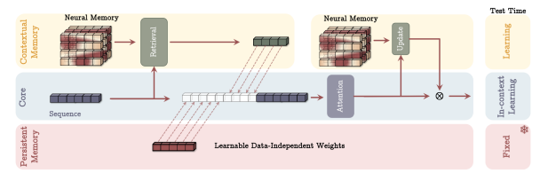

# Titans: Learning to Memorize at Test Time

[](https://python.org)
[](https://pytorch.org)
[](https://github.com/Neuranox/titans-memory)
[](LICENSE)
[](https://arxiv.org/abs/2501.00663)

A clean, highly-optimized PyTorch implementation of the **Titans** architecture from:

> **Titans: Learning to Memorize at Test Time**  
> Ali Behrouz, Peilin Zhong, Vahab Mirrokni — Google Research, 2024  
> [arXiv:2501.00663](https://arxiv.org/abs/2501.00663)

<p align="center">
  
</p>

---

## What's Inside

| Module | Description |
|---|---|
| `NeuralMemory` | Deep MLP that learns to memorize via gradient descent with **momentum** + **weight-decay forgetting** (§3) |
| `PersistentMemory` | Learnable task-knowledge tokens prepended to every sequence (§3.3) |
| `TitansMAC` | **Memory as a Context** — retrieves long-term memory as prefix to attention window (§4.1) |
| `TitansMAG` | **Memory as a Gate** — SWA ⊗ NeuralMemory gated branch (§4.2) |
| `TitansMAL` | **Memory as a Layer** — sequential LMM → SWA stack (§4.3) |
| `TitansLMM` | **Standalone LMM** — neural memory without attention (§4.3) |

---

## Installation

```bash
# Install via PyPI (Recommended)
pip install titans-memory

# Or clone and install locally for development
git clone https://github.com/Neuranox/titans-memory.git
cd titans-memory
pip install -e .
```

---

## Quick Start

```python
import torch
from titans import TitansMAC, TitansMAG, TitansMAL, TitansLMM
from titans.utils import TitansConfig, build_model, count_parameters

# ── Build from config ──────────────────────────────────────────────────
cfg   = TitansConfig.small(variant="MAC")   # ~170 M params
cfg.vocab_size = 32_000
model = build_model(cfg)
print(f"Parameters: {count_parameters(model):,}")

# ── Forward pass ───────────────────────────────────────────────────────
input_ids = torch.randint(0, 32_000, (2, 512))
labels    = input_ids.clone()

out = model(input_ids, labels=labels)
print(out["logits"].shape)   # (2, 512, 32000)
print(out["loss"].item())

# ── Generation ─────────────────────────────────────────────────────────
prompt    = torch.randint(0, 32_000, (1, 8))
generated = model.generate(prompt, max_new_tokens=50, top_k=50)
```

---

## All Four Variants

```python
VOCAB = 32_000
D     = 512

models = {
    "LMM": TitansLMM(VOCAB, d_model=D, n_layers=12, mem_layers=2),
    "MAC": TitansMAC(VOCAB, d_model=D, n_layers=12, mem_layers=2, chunk_size=128),
    "MAG": TitansMAG(VOCAB, d_model=D, n_layers=12, mem_layers=2, window=512),
    "MAL": TitansMAL(VOCAB, d_model=D, n_layers=12, mem_layers=2, window=512),
}
```

---

## TitansConfig — Paper-Scale Presets

```python
from titans.utils import TitansConfig, build_model

cfg = TitansConfig.tiny(variant="MAC")    # ~30 M  — quick experiments
cfg = TitansConfig.small(variant="MAC")   # ~170 M — paper Table 1
cfg = TitansConfig.medium(variant="MAC")  # ~340 M — paper Table 1
cfg = TitansConfig.large(variant="MAC")   # ~760 M — paper Table 1

# JSON save / load
cfg.to_json("config.json")
cfg = TitansConfig.from_json("config.json")
```

---

## Training

```python
from titans.utils.training import build_optimizer, get_cosine_schedule_with_warmup

optim = build_optimizer(model, lr=4e-4, weight_decay=0.1)          # AdamW, no wd on bias/norm
sched = get_cosine_schedule_with_warmup(optim,
            warmup_steps=2000, total_steps=100_000, min_lr_ratio=0.1)

for batch in dataloader:
    out  = model(batch["input_ids"], labels=batch["labels"])
    out["loss"].backward()
    torch.nn.utils.clip_grad_norm_(model.parameters(), 1.0)
    optim.step(); sched.step(); optim.zero_grad()
```

See `examples/02_training_loop.py` for a complete runnable example.

---

## Neural Memory — Key Equations

| Component | Equation | Description |
|---|---|---|
| Momentary surprise | `∇ℓ(M_{t-1}; x_t)` | How unexpected is `x_t`? |
| Surprise with momentum | `S_t = η_t S_{t-1} − θ_t ∇ℓ` | Eq. 10 — carries information flow |
| Forgetting gate | `M_t = (1−α_t) M_{t-1} + S_t` | Eq. 13 — weight-decay style |
| Retrieval | `y_t = M*(q_t)` | Eq. 15 — inference, no update |

---

## Running Tests

```bash
cd "Titan Model"
pip install -e .[dev]
pytest
```

---

## Project Structure

```
Titan Model/
├── titans/
│   ├── __init__.py           ← public API
│   ├── memory/
│   │   ├── neural_memory.py  ← NeuralMemory (LMM core)
│   │   └── persistent_memory.py
│   ├── models/
│   │   ├── lmm.py            ← TitansLMM
│   │   ├── mac.py            ← TitansMAC
│   │   ├── mag.py            ← TitansMAG
│   │   └── mal.py            ← TitansMAL
│   ├── ops/
│   │   ├── scan.py           ← parallel associative scan
│   │   └── attention.py      ← causal + sliding-window attention
│   └── utils/
│       ├── config.py         ← TitansConfig dataclass
│       ├── factory.py        ← build_model()
│       └── training.py       ← optimizer + LR schedule helpers
├── tests/
│   ├── test_scan.py
│   ├── test_memory.py
│   └── test_models.py
├── examples/
│   ├── 01_quickstart.py
│   ├── 02_training_loop.py
│   └── 03_memory_standalone.py
├── pyproject.toml
├── setup.py
└── README.md
```

---

## Citation

```bibtex
@article{behrouz2024titans,
  title   = {Titans: Learning to Memorize at Test Time},
  author  = {Behrouz, Ali and Zhong, Peilin and Mirrokni, Vahab},
  journal = {arXiv preprint arXiv:2501.00663},
  year    = {2024}
}
```
